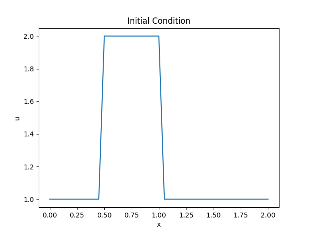
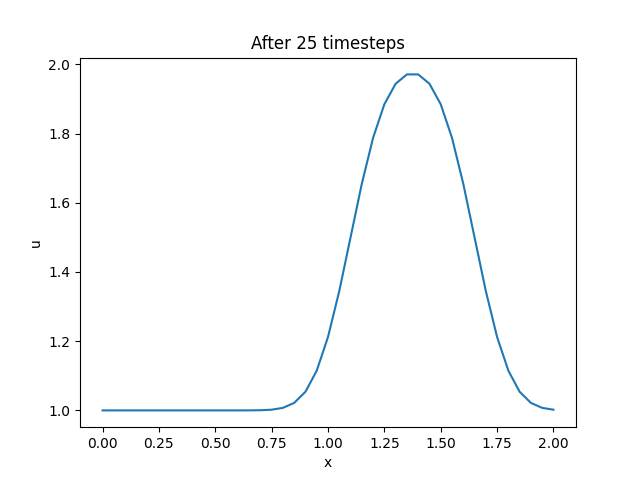
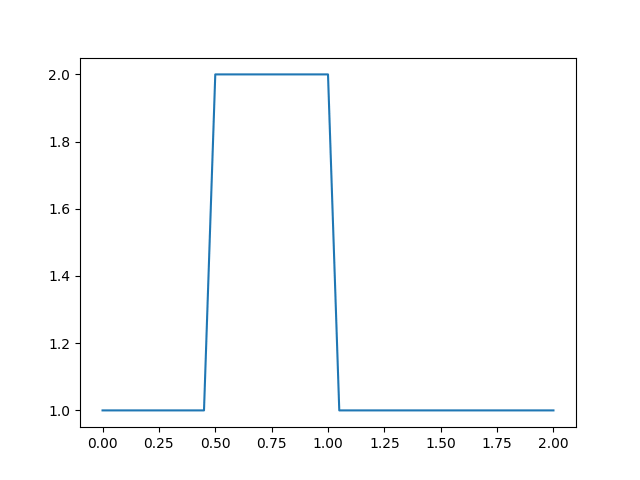
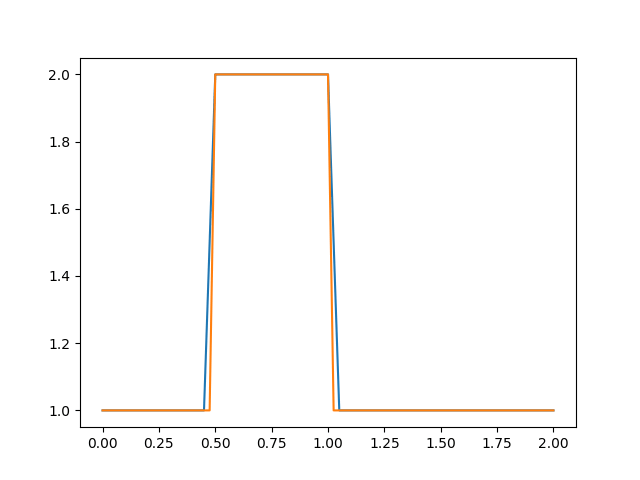

一直以来对流固耦合都很感兴趣，但流体动力学（CFD）一般使用有限体积法（FVM），而我暂时只学过有限单元法（FEM）。

最近一个偶然的机会，看到了一个教程[CFD Python](https://github.com/barbagroup/CFDPython)，其使用Python语言，通过12步，逐渐完成了一个简单的CFD求解程序。

我初略扫了一下图片，感觉很适合入门。因此，打算认真过一遍教程，以便了解FVM的基本思想和编码方式。

在学习的过程中，我也会对教程中的代码进行修改，以便更符合我自己的习惯，并进一步加深理解。

因此，这一系列文章并不是简单地对原教程的翻译，还会增加一些自己的理解和代码。

## 一维线性对流

一维线性对流方程是学习CFD的最简单、最基本的模型，其形式为：

$$
\frac{\partial u}{\partial t} + c \frac{\partial u}{\partial x} = 0
$$

如果给定一个初始条件（我们可以将其理解为波），该方程可以表示初始的波以速度 $c$ 传播，并且不会改变波的形状。
令初始条件为 $u(x, 0) = u_0(x)$，则方程的精确解为：$u(x, t) = u_0(x - ct)$。

我们需要在时间和空间上对这个方程进行离散，在时间上，我们使用向前差分格式，在空间上，我们使用向后差分格式。
考虑将空间坐标 $x$ 离散为一系列点，索引为 $i = 0, 1, 2, \ldots, N$，时间离散的步长为 $\Delta t$。

根据导数的定义，有：

$$
\frac{\partial u}{\partial x} \approx \frac{u(x + \Delta x) - u(x)}{\Delta x}
$$

我们的离散方程变为：

$$
\frac{u_i^{\tau + 1} - u_i^{\tau}}{\Delta t} + c \frac{u_i^{\tau} - u_{i-1}^{\tau}}{\Delta x} = 0
$$

其中，$\tau$ 和  $\tau + 1$ 是方程中两个连续的时间步（之所以使用符号 $\tau$ 而不使用 $t$ 是因为方程中已经使用了 $t$），
$i$ 和 $i - 1$ 是两个连续的离散空间点。

如果初始条件已经给定，那么，公式中将只有一个未知量 $u_i^{\tau + 1}$。因此，我们可以解出未知量，并在时间上向前推进：

$$
u_i^{\tau + 1} = u_i^{\tau} - c \frac{\Delta t}{\Delta x} (u_i^{\tau} - u_{i-1}^{\tau})
$$

## Python实现

先导入所需的包：

```python
import numpy as np
import matplotlib.pyplot as plt
```

然后，定义一些变量。我们设置计算域为2个单位长度，离散点等距分布，即 $x_i \in (0, 2)$。定义变量 $nx$ 为离散点的个数，
$dx$ 为离散点的步长。

```python
nx = 41
dx = 2 / (nx - 1)
nt = 25
dt = .025
c = 1
```

我们还需要设置初始条件。初始速度 $u_0$ 设置为：如果 $0.5 \leq x \leq 1$， $u = 2$；否则，$u = 1$。

```python
u = np.ones(nx)
u[int(.5 / dx):int(1 / dx + 1)] = 2
```

我们将函数图像绘制出来：

```python
plt.plot(np.linspace(0, 2, nx), u)
plt.xlabel('x')
plt.ylabel('u')
plt.title('Initial Condition')
plt.savefig('initial_condition.png')
plt.show()
```

运行程序，得到以下结果：

<!--  -->


现在，我们就可以使用有限差分格式实现这个对流方程的离散过程了。

对于数组 $u$ 的每一个元素，我们都需要实现
 $u_i^{\tau + 1} = u_i^{\tau} - c \frac{\Delta t}{\Delta x} (u_i^{\tau} - u_{i-1}^{\tau})$。

我们将结果存储到一个新的变量 $un$ 中，并在下一次迭代中作为 $u$ 的值。重复此过程，我们就能够观察到波的传播。

```python
un = np.ones(nx)

for n in range(nt):
    un = u.copy()
    for i in range(1, nx):
        u[i] = un[i] - c * dt / dx * (un[i] - un[i - 1])
```

然后，绘制图像：

```python
plt.plot(np.linspace(0, 2, nx), u)
plt.xlabel('x')
plt.ylabel('u')
plt.title('After %s timesteps' % nt)
plt.savefig('after_%s_timesteps.png' % nt)
plt.show()
```

运行程序，得到以下结果：

<!--  -->


修改代码，将数据存储到一个二维数组中，并绘制动画：
```python
import numpy as np
import matplotlib.pyplot as plt
from matplotlib.animation import FuncAnimation

nx = 41
dx = 2 / (nx - 1)
nt = 25
dt = .025
c = 1

u = np.ones((nt, nx))
u[0, int(.5 / dx):int(1 / dx + 1)] = 2

for n in range(1, nt):
    for i in range(1, nx):
        u[n, i] = u[n - 1, i] - c * dt / dx * (u[n - 1, i] - u[n - 1, i - 1])

fig = plt.figure()
ax = fig.add_subplot(111)
line, = ax.plot(np.linspace(0, 2, nx), u[0, :])


def update(frame):
    line.set_ydata(u[frame, :])
    return line


ani = FuncAnimation(fig, update, frames=nt, interval=100)
ani.save('wave1.gif', writer='imagemagick', fps=10)
plt.show()
```

运行程序，得到以下结果：
<!--  -->


可以看到，随着时间的推进，波形变得圆滑，与初始时刻不同。而正常情况下，波形并不应该改变。

其实，这是由于空间离散点太少，网格尺寸过大导致的。重新修改代码，新增一条曲线，增加离散点个数，并绘制对比动画：

```python
import numpy as np
import matplotlib.pyplot as plt
from matplotlib.animation import FuncAnimation

num = 2
nt = 25
dt = 0.025
nx_list = [41, 81]
dx_list = [2 / (nx - 1) for nx in nx_list]
labels = ['nx = 41', 'nx = 81']
c = 1

# 网格（离散点）
x_list = [np.linspace(0, 2, nx) for nx in nx_list]

# 初始条件
u_list = []
for i in range(num):
    u = np.ones((nt, nx_list[i]))
    u[0, int(0.5 / dx_list[i]) : int(1 / dx_list[i]) + 1] = 2
    u_list.append(u)

# 差分
for j in range(num):
    for t in range(1, nt):
        for i in range(1, nx_list[j]):
            u_list[j][t, i] = u_list[j][t - 1, i] - c * dt / dx_list[j] * (u_list[j][t - 1, i] - u_list[j][t - 1, i - 1])

fig = plt.figure()
ax = fig.add_subplot(111)
lines = []
for j in range(len(nx_list)):
    line, = ax.plot(x_list[j], u_list[j][0, :], label=labels[j])
    lines.append(line)


def update(i):
    for j in range(len(nx_list)):
        lines[j].set_ydata(u_list[j][i, :])
    return lines


anim = FuncAnimation(fig, update, frames=nt, interval=100)
anim.save('wave2.gif', writer='imagemagick', fps=10)
plt.legend(frameon=False, bbox_to_anchor=(1, 1.2))
plt.tight_layout()
plt.show()
```

运行程序，得到以下结果：
<!--  -->


可以看到，网格数量增加后，在波的传播过程中，波形能够保持不变。
