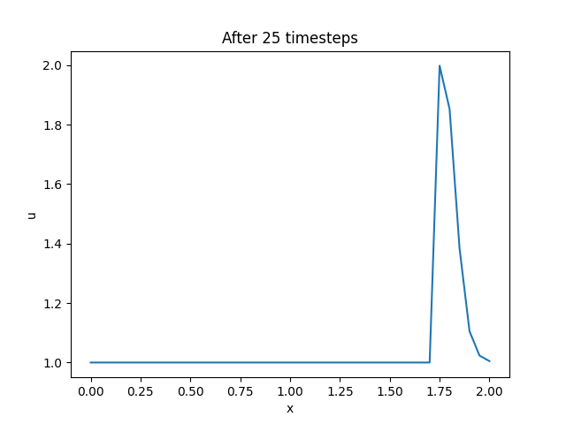
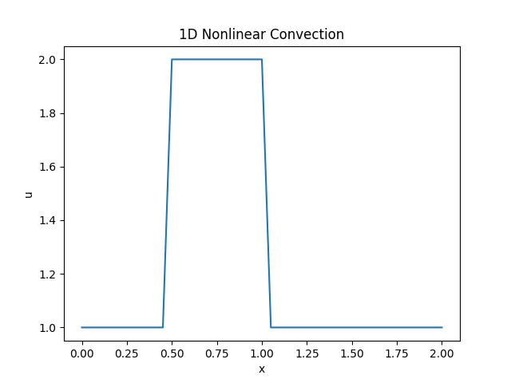
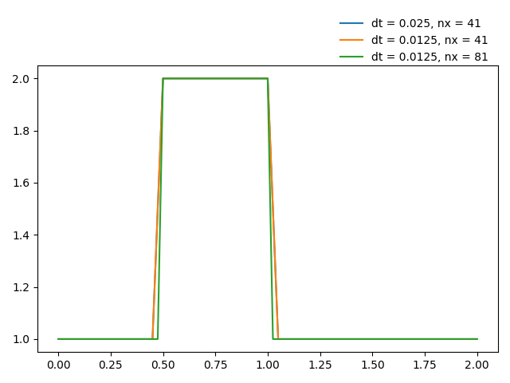

现在我们使用CFD_Python_01中同样的方法，实现一维非线性对流问题的求解。

一维非线性对流方程为：

$$
\frac{\partial u}{\partial t} + u \frac{\partial u}{\partial x} = 0
$$

在方程的第二项，我们不再乘以常数 $c$ ，而是乘以方程的解 $u$ 。因此，这个方程的第二项现在是非线性的。

我们使用 CFD_Python_01 中同样的方法，即：时间项向前差分、空间项向后差分。离散方程为：

$$
\frac{u_i^{\tau + 1} - u_i^{\tau}}{\Delta t} + u_i^{\tau} \frac{u_i^{\tau} - u_{i-1}^{\tau}}{\Delta x} = 0
$$

求解得到方程唯一的未知项 $u_i^{\tau + 1}$ ：

$$
u_i^{\tau + 1} = u_i^{\tau} - \frac{\Delta t}{\Delta x} u_i^{\tau} (u_i^{\tau} - u_{i-1}^{\tau})
$$

## Python 实现

与之前一样，我们先导入需要的库，然后申明离散空间和时间所需的变量。接着创建数组 $u$ ，令其在 $0.5 \leq x \leq 1$ 时为 $2$ ，其余范围为 $1$ 。

```python
import numpy as np
import matplotlib.pyplot as plt

nx = 41
dx = 2 / (nx - 1)
nt = 25
dt = .025

u = np.ones(nx)
u[int(.5 / dx):int(1 / dx + 1)] = 2

un = np.ones(nx)

for n in range(nt):
    un = u.copy()
    for i in range(1, nx):
        u[i] = un[i] - un[i] * dt / dx * (un[i] - un[i - 1])

plt.plot(np.linspace(0, 2, nx), u)
plt.xlabel('x')
plt.ylabel('u')
plt.title('After %s timesteps' % nt)
plt.savefig('after_%s_timesteps.png' % nt)
plt.show()
```

执行完成后，效果如下图所示。
<!--  -->


修改代码，将数据存储到一个二维数组中，并绘制动画：
```python
import numpy as np
import matplotlib.pyplot as plt
from matplotlib.animation import FuncAnimation

nx = 41
dx = 2 / (nx - 1)
nt = 25
dt = .025

u = np.ones((nt, nx))
u[0, int(.5 / dx):int(1 / dx + 1)] = 2

for n in range(1, nt):
    for i in range(1, nx):
        u[n, i] = u[n - 1, i] - u[n - 1, i] * dt / dx * (u[n - 1, i] - u[n - 1, i - 1])

fig = plt.figure()
ax = fig.add_subplot(111)
line, = ax.plot(np.linspace(0, 2, nx), u[0, :])
ax.set_xlabel('x')
ax.set_ylabel('u')
ax.set_title('1D Nonlinear Convection')


def update(frame):
    line.set_ydata(u[frame, :])
    return line


ani = FuncAnimation(fig, update, frames=nt, interval=100)
ani.save('wave1.gif', fps=10)
plt.show()
```

效果如下图所示。

<!--  -->


修改代码，设置不同的网格尺寸和时间步长，并绘制动画。由于时间步长不同，所以数组的行数有差异，为了完成动画的绘制，对时间步长较大（行数较小）的数组的行进行复制。

```python
import numpy as np
import matplotlib.pyplot as plt
from matplotlib.animation import FuncAnimation

num = 3
nt_list = [25, 50, 50]
dt_list = [0.025, 0.0125, 0.0125]
nx_list = [41, 41, 81]
dx_list = [2 / (nx - 1) for nx in nx_list]
labels = ['dt = 0.025, nx = 41', 'dt = 0.0125, nx = 41', 'dt = 0.0125, nx = 81']

# 网格（离散点）
x_list = [np.linspace(0, 2, nx) for nx in nx_list]

# 初始条件
u_list = []
for i in range(num):
    u = np.ones((nt_list[i], nx_list[i]))
    u[0, int(0.5 / dx_list[i]) : int(1 / dx_list[i]) + 1] = 2
    u_list.append(u)

# 差分
for j in range(num):
    for t in range(1, nt_list[j]):
        for i in range(1, nx_list[j]):
            u_list[j][t, i] = u_list[j][t - 1, i] - u_list[j][t - 1, i] * dt_list[j] / dx_list[j] * (u_list[j][t - 1, i] - u_list[j][t - 1, i - 1])

# nt = 25 时，数组的行数比另外两个少，复制一份，用于绘图
u_list[0] = np.repeat(u_list[0], 2, axis=0)

fig = plt.figure()
ax = fig.add_subplot(111)
lines = []
for j in range(len(nx_list)):
    line, = ax.plot(x_list[j], u_list[j][0, :], label = labels[j])
    lines.append(line)


def update(frame):
    for j in range(len(nx_list)):
        lines[j].set_ydata(u_list[j][frame, :])
    return lines


anim = FuncAnimation(fig, update, frames=nt_list[1], interval=100)
ax.legend(frameon=False, bbox_to_anchor=(1, 1.2))
plt.tight_layout()

anim.save('wave2.gif', fps=10)
plt.show()
```

效果如下图所示。

<!--  -->


可以看到，网格尺寸不变时，减小时间步长，有时候反而会使结果变得更不理想。在仿真计算时，有必要使用不同的网格尺寸、不同的时间步长，以便找到最合适的配置。
